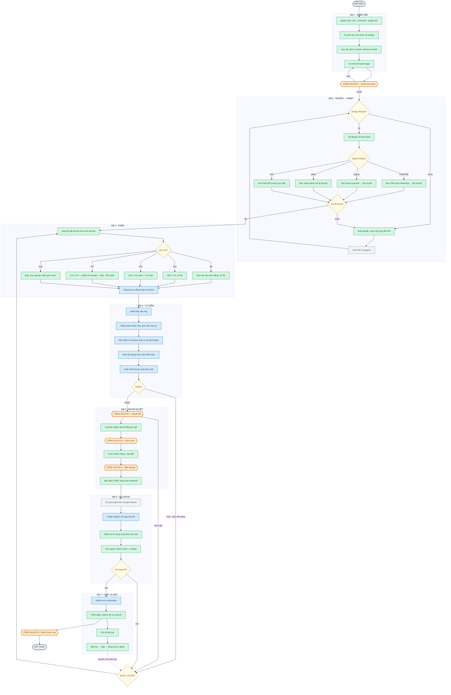

# SDLC làm việc với AI — Frontend

AI = Claude Code chạy trong terminal, gắn bộ công cụ và bộ luật riêng của FE.
Người giữ 5 cổng quyết định; AI không tự đẩy code ra ngoài.

> **Bản tương tác (khuyên dùng khi trình bày):** mở [`sdlc-ai.html`](sdlc-ai.html) trong trình duyệt — 7 tab theo giai đoạn, hover lần theo luồng, click node xem chi tiết, nút ▶ chạy luồng dừng ở từng cổng người.

| Màu | Nghĩa |
|---|---|
| Xanh lá | AI thực thi |
| Xanh dương | Cổng kiểm cơ học — phải có output thật mới qua |
| Cam, lục giác | Cổng người — AI dừng |
| Vàng, thoi | Rẽ nhánh |
| Xám | Chờ PM / QC |
