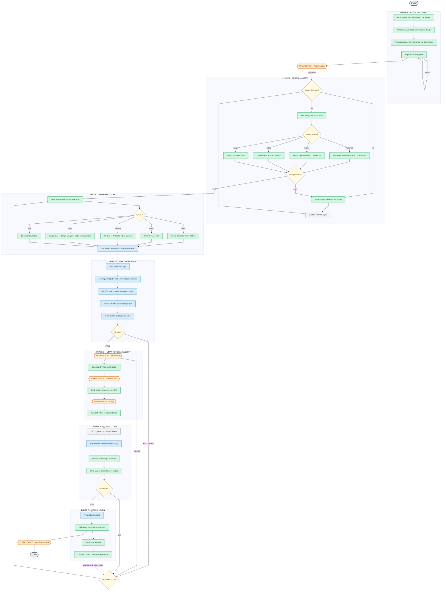

# SDLC with AI — Frontend

AI = Claude Code running in the terminal, wired with our FE tooling and rule set.
Humans own 5 decision gates; AI never pushes code out on its own.

> **Interactive version (recommended for presenting):** open [`sdlc-ai.html`](sdlc-ai.html) in a browser — 7 phase tabs, hover to trace, click a node for details, ▶ plays the flow and pauses at each human gate (switch to EN in the header).

| Color | Meaning |
|---|---|
| Green | AI executes |
| Blue | Mechanical gate — must produce real output to pass |
| Orange hexagon | Human gate — AI stops |
| Yellow diamond | Branch |
| Grey | Waiting on PM / QC |
